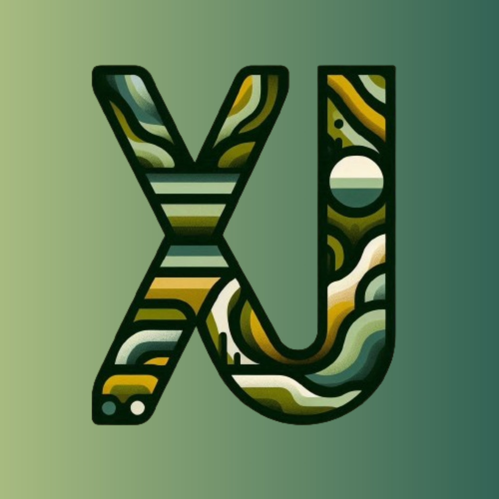

<table>
  <tr>
    <td align="center">
      
      

      <h1>Aprendiendo:</h1>
      
      
      
      
      
      

  </td>
  <td >
    <h1>Bienvenido!</h1>
    
¡Bienvenido/a a mi perfil de GitHub! Soy un joven desarrollador de 19 años de Formosa, Argentina. Aquí encontrarás una variedad de proyectos en los que he estado trabajando, principalmente utilizando el stack MERN (MongoDB, Express.js, React.js, Node.js), así como otras tecnologías como Python, Nest.js, y JavaScript en general.

  <h2>Sobre mí</h2>
    <li>🌱 Actualmente estoy estudiando la Tec. Sup. en Desarrollo de Software Multiplataforma, en el Instituto Politécnico Formosa.</li>
    <li>💼 Estoy disponible para oportunidades de trabajo, pasantías y proyectos interesantes.</li>
    <li>👯 Estoy disponible para colaboraciones y aprendizaje conjunto.</li>
    <li>📫 Puedes contactarme a través de mi <a href="mailto:Facundorios2005@gmail.com" style="color: #66cdaa;">correo electrónico</a> o por mensaje directo en <a href="https://www.instagram.com/facundorios._" style="color: #66cdaa;">Instagram</a>.</li>

  <h2 style="color: #66cdaa;">Mis Proyectos & Colaboraciones</h2>
  <ul>
    

  </ul>
</td>
  </tr>
</table>
